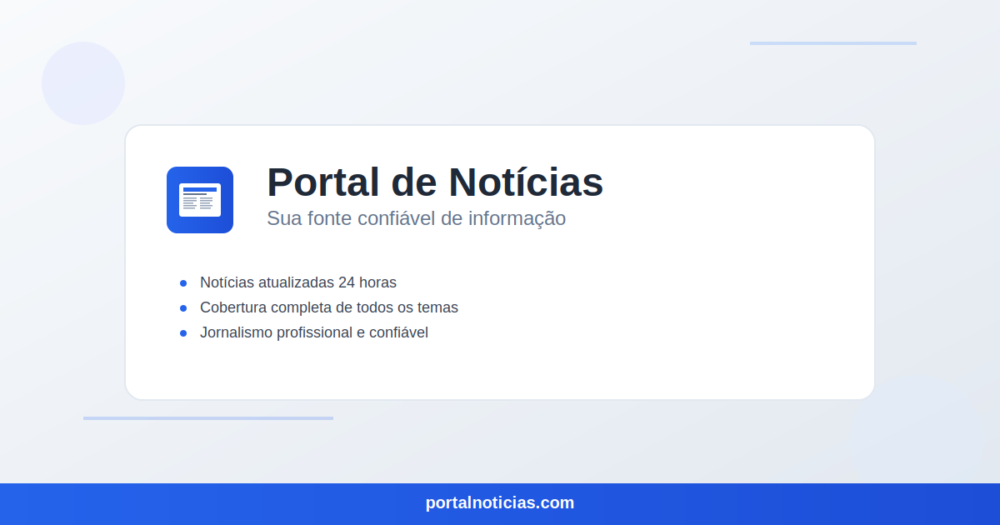

# Portal de Notícias



Um sistema completo de portal de notícias desenvolvido em PHP e JavaScript, com interface moderna e funcionalidades avançadas de gerenciamento de conteúdo.

## 🚀 Características

- **Frontend Responsivo**: Interface moderna e adaptável para todos os dispositivos
- **Sistema de Autenticação**: Login, cadastro e recuperação de senha
- **Gerenciamento de Notícias**: CRUD completo com editor rico
- **Sistema de Categorias e Tags**: Organização eficiente do conteúdo
- **Comentários**: Sistema de comentários com moderação
- **Newsletter**: Sistema de inscrição e envio de newsletters
- **Painel Administrativo**: Interface completa para gerenciamento
- **Upload de Mídia**: Sistema seguro de upload de imagens e arquivos
- **SEO Otimizado**: Meta tags, URLs amigáveis e sitemap
- **Sistema de Curtidas**: Interação dos usuários com o conteúdo

## ✅ Estado Atual do Projeto

**Status**: ✅ **FUNCIONAL** - O projeto está totalmente operacional

### Correções Recentes Implementadas:
- ✅ URLs da API corrigidas (localhost:8001 → localhost:8000)
- ✅ Páginas de categoria funcionando corretamente
- ✅ Assets (CSS/JS) carregando sem problemas
- ✅ Roteamento de arquivos estáticos configurado
- ✅ Tags `<base href="/">` adicionadas para caminhos relativos
- ✅ Estrutura do banco de dados atualizada
- ✅ Arquivos obsoletos removidos

### Arquivos Principais:
- **Backend**: `backend/router.php` - API REST
- **Frontend**: `frontend/router.php` - Interface do usuário
- **Configuração**: `config-unified.php` - Configurações unificadas
- **Banco**: `database/portal_noticias.sql` - Estrutura do banco

## 📋 Pré-requisitos

- PHP 7.4 ou superior
- MySQL 5.7 ou superior
- Apache ou Nginx
- Extensões PHP: PDO, GD, mbstring, openssl

## 🛠️ Instalação e Execução

### 1. Clone o repositório
```bash
git clone https://github.com/seu-usuario/portal-noticias.git
cd portal-noticias
```

### 2. Configure o banco de dados
```bash
# Importe o arquivo SQL
mysql -u root -p < database/portal_noticias.sql
```

### 3. Configure as variáveis de ambiente
```bash
# Copie o arquivo de exemplo
cp .env.example .env

# Edite o arquivo .env com suas configurações
```

### 4. Inicie os servidores de desenvolvimento

#### Backend (API)
```bash
php -S localhost:8000 -t backend backend/router.php
```

#### Frontend
```bash
php -S localhost:3000 -t frontend frontend/router.php
```

### 5. Acesse o sistema
- **Frontend**: http://localhost:3000
- **API Backend**: http://localhost:8000
- **Painel Admin**: http://localhost:3000/admin

### 6. Configure as permissões
```bash
# Dê permissões de escrita aos diretórios necessários
chmod 755 backend/uploads/
chmod 755 backend/logs/
```

### 5. Configure o servidor web

#### Apache
O arquivo `.htaccess` já está configurado. Certifique-se de que o mod_rewrite está ativado.

#### Nginx
Adicione a seguinte configuração ao seu arquivo de configuração do Nginx:

```nginx
server {
    listen 80;
    server_name seu-dominio.com;
    root /caminho/para/portal-noticias;
    index frontend/index.html;
    
    location / {
        try_files $uri $uri/ /frontend/index.html;
    }
    
    location /backend/ {
        try_files $uri $uri/ /backend/index.php?$query_string;
    }
    
    location ~ \.php$ {
        fastcgi_pass unix:/var/run/php/php7.4-fpm.sock;
        fastcgi_index index.php;
        fastcgi_param SCRIPT_FILENAME $document_root$fastcgi_script_name;
        include fastcgi_params;
    }
}
```

## 📁 Estrutura do Projeto

```
portal-noticias/
├── backend/                 # API e lógica do servidor
│   ├── config/             # Configurações
│   ├── controllers/        # Controladores da API
│   ├── models/             # Modelos de dados
│   ├── services/           # Serviços auxiliares
│   ├── uploads/            # Arquivos enviados
│   └── logs/               # Logs do sistema
├── frontend/               # Interface do usuário
│   ├── admin/              # Painel administrativo
│   ├── assets/             # CSS, JS e imagens
│   └── *.html              # Páginas do site
├── database/               # Scripts do banco de dados
├── .env                    # Variáveis de ambiente
├── .htaccess              # Configuração Apache
└── README.md              # Este arquivo
```

## 🔧 Configuração

### Variáveis de Ambiente (.env)

As principais configurações que você deve ajustar:

```env
# Banco de dados
DB_HOST=localhost
DB_NAME=portal_noticias
DB_USERNAME=seu_usuario
DB_PASSWORD=sua_senha

# Aplicação
APP_URL=http://seu-dominio.com
APP_ENV=production

# Email (SMTP)
SMTP_HOST=smtp.gmail.com
SMTP_USERNAME=seu-email@gmail.com
SMTP_PASSWORD=sua-senha-app

# Segurança
JWT_SECRET=sua-chave-secreta-muito-segura
```

## 📚 API Endpoints

### Autenticação
- `POST /backend/auth/login` - Login do usuário
- `POST /backend/auth/register` - Cadastro de usuário
- `POST /backend/auth/logout` - Logout
- `POST /backend/auth/forgot-password` - Recuperação de senha

### Notícias
- `GET /backend/noticias` - Listar notícias
- `GET /backend/noticias/{id}` - Obter notícia específica
- `POST /backend/noticias` - Criar notícia
- `PUT /backend/noticias/{id}` - Atualizar notícia
- `DELETE /backend/noticias/{id}` - Deletar notícia

### Categorias
- `GET /backend/categorias` - Listar categorias
- `POST /backend/categorias` - Criar categoria
- `PUT /backend/categorias/{id}` - Atualizar categoria
- `DELETE /backend/categorias/{id}` - Deletar categoria

## 🎨 Personalização

### Temas
O sistema suporta temas claro e escuro. Para personalizar:

1. Edite o arquivo `frontend/assets/css/style.css`
2. Modifique as variáveis CSS no `:root`
3. Ajuste as cores e estilos conforme necessário

### Logo e Favicon
- Logo: `frontend/assets/img/logo.svg`
- Favicon: `frontend/assets/img/favicon.svg`
- OG Image: `frontend/assets/img/og-image.svg`

## 🔒 Segurança

- Senhas criptografadas com bcrypt
- Proteção contra SQL Injection
- Validação de entrada de dados
- Headers de segurança configurados
- Proteção CSRF
- Rate limiting para login

## 📊 Monitoramento

### Logs
Os logs são armazenados em `backend/logs/`:
- `error.log` - Erros do sistema
- `access.log` - Logs de acesso
- `api.log` - Logs da API

### Estatísticas
O painel administrativo inclui:
- Total de notícias publicadas
- Usuários ativos
- Comentários aprovados
- Visualizações totais

## 🚀 Deploy

### Produção
1. Configure o ambiente de produção no `.env`
2. Desative o modo debug: `APP_DEBUG=false`
3. Configure HTTPS: `APP_URL=https://seu-dominio.com`
4. Configure backup automático do banco de dados
5. Configure monitoramento de logs

### Docker (Opcional)
```dockerfile
# Dockerfile exemplo
FROM php:7.4-apache
RUN docker-php-ext-install pdo pdo_mysql gd
COPY . /var/www/html/
RUN chown -R www-data:www-data /var/www/html/
```

## 🤝 Contribuição

1. Faça um fork do projeto
2. Crie uma branch para sua feature (`git checkout -b feature/AmazingFeature`)
3. Commit suas mudanças (`git commit -m 'Add some AmazingFeature'`)
4. Push para a branch (`git push origin feature/AmazingFeature`)
5. Abra um Pull Request

## 📝 Licença

Este projeto está sob a licença MIT. Veja o arquivo [LICENSE](LICENSE) para mais detalhes.

## 📞 Suporte

- Email: suporte@portalnoticias.com
- Issues: [GitHub Issues](https://github.com/seu-usuario/portal-noticias/issues)
- Documentação: [Wiki do Projeto](https://github.com/seu-usuario/portal-noticias/wiki)

## 🎯 Roadmap

- [ ] Sistema de notificações push
- [ ] Integração com redes sociais
- [ ] App mobile (React Native)
- [ ] Sistema de assinatura premium
- [ ] Integração com Google Analytics
- [ ] Sistema de enquetes
- [ ] Chat ao vivo
- [ ] Modo offline (PWA)

---

**Portal de Notícias** - Desenvolvido com ❤️ para informar e conectar pessoas.